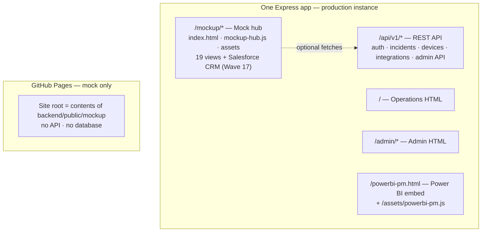

# Service Delivery Manager

**Service Delivery Manager** is the service delivery operations platform for MGM GES-West workflows: incidents, device visibility, TAC linkage, Cisco integrations (Waves 1–17 including **Salesforce CRM**), **Digitized Delivery** (Network as Code, Services as Code, Digital Document Solutions), and optional OIDC SSO. Meraki Dashboard and AppDynamics data is integrated inline across Devices, Properties, Incidents, and Overview views. **Salesforce CRM** (Wave 17) provides the CRM backbone for all six SDC program consoles via REST API v59.0.

## Table of contents

1. [Repository layout](#repository-layout)
2. [Quick start](#quick-start)
3. [UI mockup hub — page-by-page guide](#ui-mockup-hub--page-by-page-guide)
4. [Production vs mock](#production-vs-mock)
5. [Accessing the mockup](#accessing-the-mockup)
6. [Appendix: GitHub Pages troubleshooting](#appendix-github-pages-troubleshooting)
7. [Database configuration](#database-configuration)

## Repository layout

- `backend/` — Express + TypeScript API, plain HTML UI under `backend/public/`
- `frontend/` — React shell (optional; HTML UI is primary for MVP)
- `mobile/` — **React Native / Expo** cross-platform mobile app (iOS + Android) with SSO support — see [`mobile/README.md`](mobile/README.md)
- `infra/` — PostgreSQL migrations and seeds
- `docs/` — Supplemental documentation ([HELIX_MOCKUP_REFERENCE.md](docs/HELIX_MOCKUP_REFERENCE.md) companion, [HELIX_MOCKUP_REFERENCE_PRINT.html](docs/HELIX_MOCKUP_REFERENCE_PRINT.html) for PDF export, [POWERBI_GLOBAL_PM.md](docs/POWERBI_GLOBAL_PM.md); optional [MOCKUP_HUB_USER_GUIDE.pdf](docs/MOCKUP_HUB_USER_GUIDE.pdf) from `npm run docs:mockup-pdf`)

## Quick start

From `backend/` (PostgreSQL must be running and reachable via `DB_*` in `.env`):

```bash
npm ci
npm run build
npm run migrate
npm start
```

**Sign-in (local seed users)** — password for all: `ChangeMe123!`

| Email | Role |
| --- | --- |
| `admin@serviceflow.local` | admin |
| `sdm@serviceflow.local` | sdm |
| `engineer@serviceflow.local` | engineer |

If login returns **401** / “Invalid username or password”: the database may still have an old hash. Run **`npm run seed-passwords`** from `backend/` (updates seed users with a fresh bcrypt hash for `ChangeMe123!`), or run **`npm run migrate`** again. Migrations automatically apply the same password fix after SQL seeds.

Default UI: [http://localhost:3000/](http://localhost:3000/) · Source admin (live app): [http://localhost:3000/admin/sources.html](http://localhost:3000/admin/sources.html) · **UI mockup hub:** [http://localhost:3000/mockup/](http://localhost:3000/mockup/)

### OpenID Connect SSO (Cisco / Azure AD / Okta / etc.)

The API already implements **OAuth 2.0 authorization code + PKCE** against any OIDC IdP (`openid-client`). “Cisco SSO” in production is usually your organization’s IdP (often Azure AD, Okta, Ping, or **Cisco Secure Access**) — use the **issuer URL** and client settings from that console, not a single global “Cisco password.”

1. **Create an OIDC application** at your IdP (confidential or public client).
2. **Redirect URI** (must match exactly):  
   `{APP_PUBLIC_URL}/api/v1/auth/sso/callback`  
   Example local: `http://localhost:3000/api/v1/auth/sso/callback`
3. **Scopes:** include `openid profile email` so the IdP returns an email-shaped claim (`email`, `mail`, `preferred_username`, etc.).
4. **`.env`** (see `.env.example`):

   | Variable | Purpose |
   | --- | --- |
   | `SSO_ENABLED` | `true` |
   | `APP_PUBLIC_URL` | Public origin of this API (e.g. `https://sdm.example.com`) |
   | `SSO_ISSUER` | OIDC issuer URL from discovery (IdP admin / docs) |
   | `SSO_CLIENT_ID` | Application (client) ID |
   | `SSO_CLIENT_SECRET` | Client secret if confidential; leave empty for public + PKCE |
   | `SSO_REDIRECT_URI` | Same as step 2 |
   | `SSO_SUCCESS_REDIRECT` | Where to send the browser after login (e.g. `https://sdm.example.com/`) — tokens are appended in the **URL hash** |
   | `SSO_JIT_DEFAULT_ROLE` | Optional: `viewer`, `engineer`, etc. Provisions `mgm.users` on first SSO when empty accounts would otherwise 403 |

5. **User matching:** SSO signs you in only if **`mgm.users.email`** matches the email from the IdP (case-insensitive), **unless** `SSO_JIT_DEFAULT_ROLE` is set to auto-create users.
6. Restart the backend. On **Operations**, use **Sign in with SSO** (`/api/v1/auth/sso/login`).

**Local dev:** The IdP must allow `http://localhost:3000/...` as a redirect URI. **HTTPS in production:** set `Secure` cookies implicitly via `NODE_ENV=production` for the short-lived SSO state cookie.

---

## UI mockup hub — page-by-page guide

The **mockup hub** is a static preview at `backend/public/mockup/index.html`. All metrics, tables, and buttons are **illustrative** unless wired to the live API. Use the left navigation or deep links with URL hashes (for example `…/mockup/#incidents`).

**A printable PDF of this section** (plus repo basics) is maintained at [`docs/MOCKUP_HUB_USER_GUIDE.pdf`](docs/MOCKUP_HUB_USER_GUIDE.pdf). Regenerate after editing this README: `npm run docs:mockup-pdf` from the repo root (requires Node.js; see `package.json`).

**Extended companion** (all hub pages, widgets, integration matrix, CX role playbook): [`docs/HELIX_MOCKUP_REFERENCE.md`](docs/HELIX_MOCKUP_REFERENCE.md). **Export PDF:** `npm run docs:helix-mockup-reference-html` then open [`docs/HELIX_MOCKUP_REFERENCE_PRINT.html`](docs/HELIX_MOCKUP_REFERENCE_PRINT.html) → Print → Save as PDF; or `npm run docs:helix-mockup-reference-pdf` when Puppeteer works locally.

### How to use (all pages)

- **Navigate:** Click a sidebar tab, or share a URL with `#<view-id>` (see each section below).
- **Sidebar clock:** Shows **12-hour** local time and **city, state/region** (from browser geolocation + reverse geocode, cached per session; requires location permission). Hosted copies need **HTTPS** (or localhost) for geolocation in most browsers.
- **Deep links in content:** Inline links with “mock jump” switch views without reloading.
- **Right rail “Deep insights”:** Mock Microsoft 365 Copilot–oriented assistant copy that changes per tab; use for demo narrative only.
- **Theme:** Use the header appearance controls; choices persist in `localStorage`. **Match daylight at location** uses the browser’s geolocation once (with consent) and [sunrise-sunset.org](https://sunrise-sunset.org/) to pick light between sunrise and sunset for that position; if location or the API is unavailable, it falls back to a simple local-time day window (7:00–19:00). **Match system setting** follows OS light/dark instead.

---

### 1. Overview — `#overview`

| | |
| --- | --- |
| **Purpose** | Command surface: KPI strip, grouped quick actions (syncs by domain), activity timeline, and **Integration sync status** cards driven from the mock registry. |
| **Primary roles** | Service Delivery Manager, Engineer (read), Project Manager (read), CXM (read). |

**How to use**

- Scan KPIs for incident load, P1/P2 concentration, device coverage, TAC linkage, licensing, advisories, field notices, and blended guest sentiment.
- Use **Quick actions** clusters: respond/escalate, inventory sync (Catalyst Center, FMC, ISE), observability (ThousandEyes, Umbrella, SNA, DWDM), risk/licensing/VoC hooks. Buttons are mock (`alert` placeholders).
- Read **Activity** for recent timeline events (TAC links, FN matches, wave validations).
- Review **Integration sync status** for last-run flavor text per enabled source.

**Recommended next steps (product / demo)**

- Wire KPIs to `/api` aggregates and replace static numbers with live query results.
- Implement real “Sync …” jobs calling integration runner + show job IDs in the activity feed.
- Link “New incident” to the live incident wizard on the main app.

---

### 2. Sentiment & VoC — `#sentiment`

| | |
| --- | --- |
| **Purpose** | Blended customer sentiment (CSAT, NPS, at-risk journeys, ingest lag), escalation queue narratives, and a **Voice-of-customer API integrations** catalog (Qualtrics, Medallia, Dynamics Customer Voice, Zendesk, Webex CC, Salesforce). |
| **Primary roles** | Customer Experience Manager, SDM, PM (read). |

**How to use**

- Interpret the composite bar and notes as **mock** VoC blending (incidents + surveys + transcripts).
- Use **Escalation queue** threads to simulate SDM/CX ownership handoffs.
- Use the integrations table to explain **auth patterns** and scheduling in sales or architecture conversations.

**Recommended next steps**

- Connect one survey source (sandbox) and pipe normalized scores into this view.
- Add drill-down from an escalation row to **Journey signals** or **Incidents** via real entity IDs.

---

### 3. Journey signals — `#journeys`

| | |
| --- | --- |
| **Purpose** | Journey health grid (phase, sentiment, top driver, linked incidents) and **Journey & product analytics APIs** (Adobe AEP, event platforms, DNA intent APIs, internal event bus). |
| **Primary roles** | CXM, CDA, SDM. |

**How to use**

- Relate each journey row (for example “Gaming floor Wi‑Fi”) to infrastructure incidents and sentiment badges.
- Use the API table to align **telemetry join** and step-mapping contracts with architects.

**Recommended next steps**

- Define canonical `journey_step` events in the bus and map DNA client experience issue IDs.
- Add click-through from **Strained** journeys to device/path evidence on **Devices** or **Incidents**.

---

### 4. Experience command — `#cx-command`

| | |
| --- | --- |
| **Purpose** | Cross-program **unified queue**: financial KPIs (ACV, renewal risk, support cost/device), ranked **next steps** from PM / Delivery / CX / Renewals / Architect lenses, customer financial table, trend sparkline charts, and **AI analysis** recommendations. |
| **Primary roles** | CXM, Renewals, PM, SDM, CDA — executive and QBR prep. |

**How to use**

- Read **Recommended next steps** cards: **Visibility** (risk early) vs **Action** (do now). Follow inline mock jumps to Incidents, Devices, Journeys, Properties, Integrations, Sources, Sentiment.
- Use **Customer financial detail** for illustrative FY24/FY25 lines (subscription TCV, PS, support burndown, true-up risk).
- Treat **AI analysis** as mock scoring; production should cite sources and require human approval for spend.

**Recommended next steps**

- Integrate CPQ/ERP exports (Salesforce Revenue Cloud, Dynamics Finance, NetSuite OData) with property graph keys.
- Persist “Push to PM RAID” / “Export renewals brief” to real workflows.

---

### 5. CX role actions — `#cx-role-actions`

| | |
| --- | --- |
| **Purpose** | Role-based adoption, cost, speed, and CSAT impact matrix. Each SDC role (PM, SDM, CXM, Renewals, CDA, Engineer, HTOM) maps to quantified business levers with Salesforce CRM data feeds and Digitized Delivery automation signals. |
| **Primary roles** | All SDC personas; HTOM for exec consumption. |

**How to use**

- Review **CX role data feeds** table to understand which Salesforce objects and DD waves feed each persona.
- Use the **role action cards** (populated by JS) for persona-specific adoption recommendations.

**Recommended next steps**

- Wire live role metrics from Salesforce console-summary API.
- Add drill-through to per-persona dashboards from each role card.

---

### 6. Power BI · Global PM — `#powerbi-pm`

| | |
| --- | --- |
| **Purpose** | Embedded **Power BI Global PM dashboard** for cross-property financial and operational analytics. Falls back to a configuration prompt when `POWERBI_*` env vars are not set. |
| **Primary roles** | PM, HTOM, CXM. |

**How to use**

- If Power BI is configured, the view embeds the live report with filter/page-navigation panes.
- If not configured, a placeholder describes the required env vars and links to `docs/POWERBI_GLOBAL_PM.md`.

**Recommended next steps**

- Enable RLS (row-level security) filtering by property/account for PM role isolation.
- Add Salesforce pipeline overlay data alongside Power BI financials.

---

### 7. Incidents — `#incidents`

| | |
| --- | --- |
| **Purpose** | Incident operations: queue metrics, filter chips, mock table (ID, priority, status, property, owner, TAC), detail preview (INC-20244 sketch), TAC correlation. |
| **Primary roles** | SDM, Engineer. |

**How to use**

- Walk through **P1/P2** rows and TAC SR alignment for bridge/runbook storytelling.
- Use **Detail preview** and **TAC correlation** table in workshops aligned to ` /api/v1/incidents`.

**Recommended next steps**

- Bind list to live API; enable search and chips; replace readonly inputs.
- Wire “Open in live app” to a real incident deep link.

---

### 8. Devices — `#devices`

| | |
| --- | --- |
| **Purpose** | Inventory sample from Catalyst Center + FMC (W16) flavor: hostnames, roles, health, CVE counts, site, assurance issues. |
| **Primary roles** | Engineer, SDM, CDA. |

**How to use**

- Filter chips demonstrate site/model/ISE/FMC scenarios; **Sync now** is mock.
- **Assurance issues** table shows DNA-style P2/P3 examples.

**Recommended next steps**

- Connect to DNA + FMC inventory APIs; add pagination and serial/CVE drill-down to **Security (PSIRT)**.

---

### 9. Properties — `#properties`

| | |
| --- | --- |
| **Purpose** | Portfolio cards for MGM Las Vegas vs **remote** sites; adoption bars, incidents, wave tags; **Property ↔ site mapping** and **Technology at property** panels (rendered from mock registry). |
| **Primary roles** | PM, CXM, CDA, SDM. |

**How to use**

- Use region chips (**All / Las Vegas / Remote**) to filter cards.
- Cross-check DNA site names and wave coverage per venue for readiness decks.

**Recommended next steps**

- Drive cards from `properties` + site graph tables; link each card to Devices filtered by site.

---

### 10. Waves & integrations — `#integrations`

| | |
| --- | --- |
| **Purpose** | MVP **wave** cards (from `MVP_SCOPE_FREEZE` narrative), KPIs (sources enabled, waves in scope, API products), and **API connection builds** matrix from the integration registry (`integration_source_configs` shape). |
| **Primary roles** | CDA, SDM, PM. |

**How to use**

- Review wave grid for gate discussions and dependency ordering.
- Export **registry** mock for architecture reviews.

**Recommended next steps**

- Reflect live enablement flags from DB; show last-success / last-error per source alongside wave IDs.

---

### 11. MVP journey & adoption — `#mvp-journey`

| | |
| --- | --- |
| **Purpose** | Cisco **customer journey map** per MVP product (16 waves on a 6-phase lifecycle), with deep panels for **CSPC** collector/Smart Account and **Cisco IQ** entitlement readiness. Includes DD automation adoption by journey phase (NaC, SaC, Meraki as Code, AppDynamics) and Salesforce pipeline alignment. |
| **Primary roles** | PM, CXM, TAM. |

**How to use**

- Walk the **journey map** to discuss where each wave sits in Evaluate → Commit → Implement → Optimize.
- Review **DD automation adoption** table to see NaC/SaC/Meraki/AppDynamics readiness per phase.
- Use **Salesforce pipeline alignment** to correlate Opportunities with journey phases.
- Merge live CSPC/IQ data with admin token (manager+ role).

**Recommended next steps**

- Automate journey-phase detection from wave maturity scores.
- Connect Salesforce Opportunity stage changes to journey-phase transitions.

---

### 12. Source administration — `#sources`

| | |
| --- | --- |
| **Purpose** | Operator view mirroring ` /admin/sources.html` concepts: per-source cards, search/filter chips, change log, **environment checklist** (`OPENVULN_*`, `FIELD_NOTICE_*`, `FMC_*`, ISE notes). |
| **Primary roles** | SDM, platform admin. |

**How to use**

- Walk credential **Vault** posture (mock — no secrets displayed).
- Align checklist bullets with `.env.example` before enabling sources in dev/stage.

**Recommended next steps**

- Deep-link “Add credential ref” to the live admin UI; show real health-check failures from workers.

---

### 13. Console ↔ wave map — `#consoles`

| | |
| --- | --- |
| **Purpose** | Table mapping **SDC vendor consoles / surfaces** to MVP waves and parity themes (`CISCO_DATA_SOURCES.md` alignment); **Out of MVP** callout (Meraki, AppDynamics). |
| **Primary roles** | CDA, PM. |

**How to use**

- Filter consoles and waves for steering committees; cite API-only parity rule (no UI scraping).

**Recommended next steps**

- Keep tbody in sync with docs via CI check or generated markdown import.

---

### 14. SDC personas & consoles — `#sdcroles`

| | |
| --- | --- |
| **Purpose** | **Persona workspaces** (PM, SDM, CXM, CDA, Engineer): how each role uses SDM vs native consoles; **Live recommended next steps** panel (refreshes when you open the tab) with role cards and provenance; program **console cards** (PM, Service Delivery, Success, Renewals, Delivery Architect); renewal pipeline table; RACI matrix; doc pointers. |
| **Primary roles** | All SDC personas — training and stakeholder alignment. |

**How to use**

- Assign attendees a persona and walk their **Jump** links.
- Re-open the tab or refresh to re-run **Live recommended next steps** demo narrative.
- Use **Renewal pipeline** and **Persona ↔ console matrix** in renewal / governance meetings.

**Recommended next steps**

- Back live recommendations with rules engine or LLM grounded strictly in tenant APIs; log rationale codes.

---

### 15. Security (PSIRT) — `#security`

| | |
| --- | --- |
| **Purpose** | OpenVuln-themed advisory grid (Wave 14): CVSS, exposure, affected counts, remediation queue, masked OAuth token health. |
| **Primary roles** | SecOps, NetEng, SDM, Engineer. |

**How to use**

- Relate **CVEs in estate** to device rows; walk **Remediation queue** change windows.
- Explain `id.cisco.com` OAuth pattern for OpenVuln (mock token panel).

**Recommended next steps**

- Hook “Run advisory sync” to worker job; join inventory from DNAserial → advisory match table.

---

### 16. Field notices — `#fieldnotes`

| | |
| --- | --- |
| **Purpose** | Wave 15 field-notice KPIs, FN table (ID, severity, PID scope, property matches), bulk mock actions (export serials, create incident, email owners). |
| **Primary roles** | SDM, NetEng, PM. |

**How to use**

- Trace FN74218-style optics issues to **Devices** and property owners.
- Use **Bulk actions** for runbook storytelling (all mock).

**Recommended next steps**

- Implement FN feed ingestion + inventory join; gate bulk email on approval workflow.

---

### 17. Network as Code — `#network-as-code`

| | |
| --- | --- |
| **Purpose** | Cisco NaC strategic positioning engine: solution cards for Catalyst Center, SD-WAN, ISE, IOS-XE, and the NaC toolchain (nac-collector, nac-test, nac-validate, nac-tool, nac-api). API capability matrix, customer adoption framework (Collect → Validate → Automate → Integrate), and estate-mapped readiness scores. |
| **Primary roles** | CDA, Engineer, SDM, PM. |

**How to use**

- Review **NaC solution cards** for each technology's API capability, automation environment, estate match score, and positioning pitch.
- Use the **API capability matrix** to cross-reference Terraform/Ansible/NaC-tool support and training resources.
- Walk the **Customer adoption positioning framework** (4 phases) in stakeholder and architecture conversations.
- All scores reference the customer's deployed stack from **Devices**, **Properties**, and **Waves & integrations**.

**Recommended next steps**

- Wire estate match scores to live device inventory and wave enablement flags.
- Integrate nac-collector baseline snapshots into the NaC view as a "current state" data source.
- Link training vault entries to customer-accessible learning lab instances.

---

### 18. Services as Code — `#services-as-code`

| | |
| --- | --- |
| **Purpose** | Cisco SaC development waves (A–J + DDS): ACI, SD-WAN, NDFC, ISE, Meraki, Catalyst Center, Unified Branch, FMC, IOS-XE, IOS-XR, SaC AI Assistant, and Digital Document Sharing. Partner co-delivery routes, Cisco Live sessions, case studies, and SaC API capability summary. Ansible + Terraform automation environments per wave. |
| **Primary roles** | CDA, Engineer, SDM, PM, CXM. |

**How to use**

- Each **development wave card** shows API type, Terraform/Ansible support, AI Assistant availability, and a customer-facing sales pitch.
- Use the **Partner co-delivery & route-to-market** table for engagement model discussions.
- Reference **Case studies, Cisco Live sessions & resources** for customer positioning and QBR preparation.
- The **SaC API capability summary** table provides a quick reference for all technologies.

**Recommended next steps**

- Align SaC wave prioritization with customer investment and NaC readiness scores.
- Demo the SaC AI Assistant (ACI/NDFC/SD-WAN) in architecture workshops.
- Establish partner co-delivery agreements for applicable technologies.

---

### 19. Digital Document Solutions — `#digital-document-solutions`

| | |
| --- | --- |
| **Purpose** | DDS — document lifecycle management: template library, auto-populated generation from SDM data, multi-stakeholder approval workflows, secure customer-facing sharing, and version control. API endpoints for programmatic document management. |
| **Primary roles** | SDM, PM, CXM, CDA. |

**How to use**

- Review **Document templates** for available auto-populated templates (Network Assessment, Automation Readiness, Incident Summary, QBR Pack, Security Posture, Wave Runbook).
- Walk the **Document lifecycle** phases (Generate → Review & Approve → Share & Distribute → Archive & Version).
- Reference **DDS API capability** for integration endpoints (`/api/v1/dds/*`).

**Recommended next steps**

- Wire document generation to live SDM data (incidents, devices, properties, NaC scores).
- Implement secure share link infrastructure with expiry and access logging.
- Create custom templates aligned to SaC wave milestones.

---

### 20. Meraki + AppDynamics (inline data — no standalone pages)

Meraki Dashboard and AppDynamics data is **integrated inline** across existing views rather than having standalone pages:

| Data source | Visible on | What it shows |
| --- | --- | --- |
| **Meraki Dashboard API v1** | **Devices** (cloud-managed inventory), **Properties** (per-site DD readiness), **Waves & Integrations** (DD-K wave) | Network inventory, device/client counts, uplink status, config templates |
| **AppDynamics Controller API** | **Devices** (infra ↔ app mapping), **Incidents** (health-rule correlation), **Overview** (automation pulse), **Waves & Integrations** (DD-L wave) | App health, Apdex, BT monitoring, infrastructure nodes |

Both are also included as Digitized Delivery waves (DD-K and DD-L) in the Waves & Integrations registry.

---

### 21. Salesforce CRM (Wave 17 — all SDC consoles)

**Salesforce CRM** is the CRM backbone for all six SDC program consoles. The integration uses OAuth 2.0 connected app (password flow) with Salesforce REST API v59.0 and parameterized SOQL queries.

| SDC Console | SF Objects Used | Access | What it powers |
| --- | --- | --- | --- |
| **SDM PM Console** | Accounts, Opportunities, Tasks, Cases | Read | Pipeline overview, milestone tracking, account health |
| **Service Delivery Console** | Cases, Accounts, Contacts | Read/Write | Case ↔ incident correlation, escalation workflows |
| **Success Console** | Accounts, Entitlements, Tasks, Contacts | Read | Adoption narratives, entitlement health, customer risk |
| **Renewals Console** | Opportunities, Entitlements, Service Contracts | Read/Write | Renewal pipeline, expiring entitlements, quote readiness |
| **Delivery Architect Console** | Accounts, Cases, Knowledge Articles | Read | Design patterns, reference architectures, audit trail |
| **High Touch Operations Console** | Accounts, Cases, Contacts, Tasks | Read | Executive CRM pulse, stakeholder mapping |

**Backend routes:** `/api/v1/salesforce/*` — cases, accounts, contacts, opportunities, entitlements, service-contracts, tasks, knowledge, console-summary, status.

**Frontend:** Dedicated Salesforce page at `/salesforce` with KPI strip, tabbed data views (Cases, Accounts, Opportunities, Entitlements, Contacts), and console summary metrics.

**Environment:** Set `SALESFORCE_ENABLED=true` and configure `SALESFORCE_CLIENT_ID`, `SALESFORCE_CLIENT_SECRET`, `SALESFORCE_USERNAME`, `SALESFORCE_PASSWORD`, `SALESFORCE_SECURITY_TOKEN` in `.env` (see `.env.example`).

**Source Admin:** Registered as `salesforce` in the integration source config (Wave 17), with connection test via `/api/v1/admin/sources/salesforce/test`.

---

### 22. Related surfaces (outside the hub shell)

| Surface | URL (local) | Notes |
| --- | --- | --- |
| **Live source admin** | `http://localhost:3000/admin/sources.html` | Real configuration UI; not the mock. |
| **Helix logo variants** | `http://localhost:3000/mockup/helix-logo-variants.html` | Brand / SVG review only. |

---

## Production vs mock

| | **Production** | **Mock only** |
| --- | --- | --- |
| **What** | Express API, database-backed data, real auth (cookies / SSO), admin and operations HTML that talk to `/api/v1/*` | Static **mockup hub** under `backend/public/mockup/` — illustrative KPIs, tables, and buttons unless you wire fetches yourself |
| **Code** | `backend/src/`, `infra/`, migrations | `backend/public/mockup/*` (plus GitHub Pages workflow publishing that folder) |
| **Deploy** | Your host (VM, K8s, etc.) with Postgres, secrets, TLS | GitHub Pages: **no** bundled API or database |

The backend serves **both** from one process: static files from `backend/public/` (including `/mockup/`) sit next to the JSON API. Relaxed Content-Security-Policy applies only under `/mockup` (see `backend/src/middleware/helmetByPath.ts`).

**URL map** (default local origin `http://localhost:3000`; replace with your production host when deployed):



Deep links inside the hub use the hash: e.g. `http://localhost:3000/mockup/#overview`.

---

## Accessing the mockup

| Channel | URL / command |
| --- | --- |
| **Local (backend running)** | [http://localhost:3000/mockup/](http://localhost:3000/mockup/) |
| **Standalone zip/folder (no backend)** | From repo root: `npm run package:mockup` → `dist/helix-mockup-standalone/` and `dist/helix-mockup-standalone.zip`. Recipient unzips, runs `npx serve -l 8080 .` or `python3 -m http.server 8080`, opens http://localhost:8080/ — see folder `README.md`. |
| **GitHub Pages (public)** | After enabling Actions → Pages from `.github/workflows/deploy-mockup-pages.yml`, typically `https://<user-or-org>.github.io/<repo>/` — see [Appendix](#appendix-github-pages-troubleshooting). |
| **Ad hoc tunnel** | With backend up, tools such as [ngrok](https://ngrok.com/) can expose `…/mockup/`; follow your org security policy. |

---

## Appendix: GitHub Pages troubleshooting

**If you see 404:**

1. **Repo → Settings → General → Danger Zone** — confirm the repo name and **Public** visibility (GitHub Free serves public Pages at `*.github.io` unless your plan allows private Pages).
2. **Repo → Settings → Pages** — **Build and deployment → Source:** choose **GitHub Actions** (not “Deploy from a branch”).
3. **Actions** tab — open **Deploy UI mockup to GitHub Pages**. Ensure the latest run is **green**. If “Waiting for approval”, check **Settings → Environments → `github-pages`**.
4. Open the site root published by the workflow (often **no** `/mockup/` path if `index.html` is at the artifact root).
5. Re-run the workflow after Settings changes.

**If you don’t see the workflow under Actions:**

1. Confirm `.github/workflows/deploy-mockup-pages.yml` exists on GitHub on your default branch.
2. **Settings → Actions → General** — ensure actions are allowed.
3. Push the workflow and use **Run workflow** manually if needed.

---

## Database configuration

Database default name remains `helix_sdm` (configure via `DB_NAME` in `.env`).
